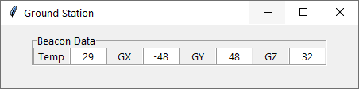

# GUI Ground Station

The [command line ground station](https://github.com/huiminlim/ground_stn) was built previously, so it's time for the GUI ground station to be built.

## Getting Started

## Features

## Requirements Gathering

## UI/UX Design and Mockup

The beacons screen were added first.

This is how the initial beacon tickers work.

## Development Process

## Info

How to run a long running process alongside Tkinter GUI: [here](https://zetcode.com/articles/tkinterlongruntask/)
