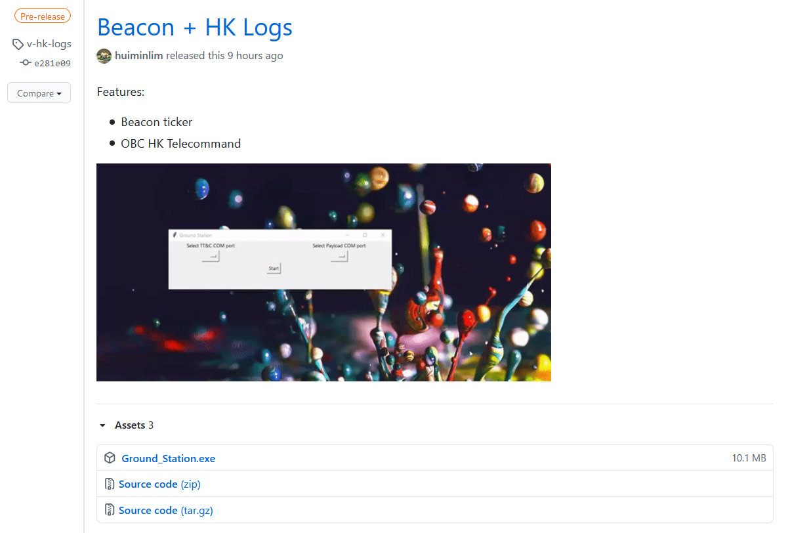
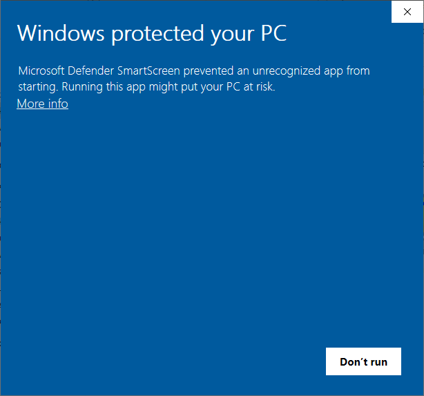
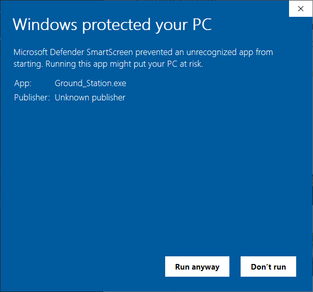
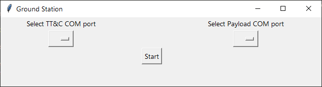
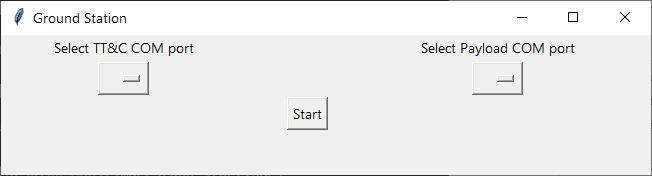
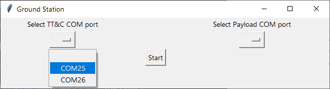
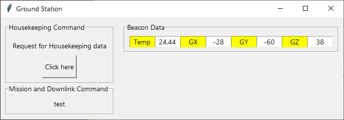

# GUI Ground Station

The [command line ground station](https://github.com/huiminlim/ground_stn) was built previously, so it's time for the GUI ground station to be built.

## Getting Started

To begin, download the Ground Station Desktop app.

Download the latest version of the Ground Station Desktop app `Ground_Stn.exe` from the `Releases` page [here](https://github.com/huiminlim/ground_stn-gui/releases).

Navigate to the section as shown in the screenshot below to find the latest version of the Ground Station Desktop app.

|  |
| ------------------------------------------------------------------ |

You can find the latest version of the Ground Station Desktop app and the Version tag in the table below.

| Executable Name  | Version Number |
| ---------------- | -------------- |
| `Ground_Stn.exe` | `v-beacon-hk`  |

Click on the `Ground_Stn.exe` under the `Assets` section to download it.

After downloading the Desktop app, start the Ground Station Desktop app.

A security warning may pop up in some cases. In such cases, click on `More Info` as shown in the screenshot below.

After that, click on `Run anyway`.

To check if the Ground Station is downloaded correctly, the Ground Station Desktop app will appear, like in the screenshot below.

## Features

The Ground Station app has several functions to interact with the CubeSat.

### Port Setup

| ⚠️ | **Ensure that your Ground Station app is closed before continuing with this section.** |
| - | -------------------------------------------------------------------------------------- |

To setup the Ground Station, connect the 2 transceivers to talk to the TT&C and Payload to your laptop.

The transceivers need a intermediary bridge to connect its pins to the USB ports of laptops and an USB adapter is used.

This is how the TT&C transceiver connected to the USB adapter.

Similarly, this is how the Payload transceiver is connected to the USB adapter.

The first page of the Ground Station app shows the serial port selection.

Click [here](#for-windows) for Window OS instructions and [here](#for-mac) for Mac.

| 💡 | **Plug the transceivers into your laptop sequentially for this step.** |
| --- | -------------------------------------------------------------------- |

#### For Windows

 🔔 <b>How to access Device Manager</b> 🔔 

 

Press and hold the Windows key and type in <code> Device Manager </code>.

Click on <code> Device Manager </code> and navigate to <code> COM and LPT </code>

View the current COM port of the USB inserted.

Plug in the USB adapter for the TT&C transceiver to the laptop.

Take note of the COM port assigned to the TT&C transceiver's USB adapter by checking the Device Manager.

Plug in the USB adapter for the Payload transceiver to the laptop.

Take note of the COM port assigned to the Payload transceiver's USB adapter by checking the Device Manager.

Select the correct Ports in the Ground Station with the COM ports noted down by clicking on the respective drop down menus.

To complete, click on `Start`.

#### For Mac

In progress.

### Beacons

The panel on the right is to capture the Beacons that the Cubesat sends out every 60 seconds.

Once the Ground Station receives a new Beacon, the fields will display a yellow alert when it updates the Beacon panel.

### Housekeeping Data Telecommands

### Mission and Downlink Telecommands

In progress.

## Requirements Gathering

## UI/UX Design and Mockup

The beacons screen were added first.

This is how the initial beacon tickers work.

## Software Architecture

## Info

How to run a long running process alongside Tkinter GUI: [here](https://zetcode.com/articles/tkinterlongruntask/)
