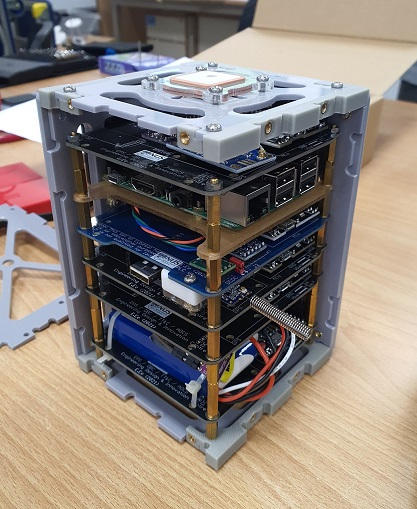

# Dreams2space GUI Ground Station

The Dream2space Cubesat is an educational cubesat assembled as part of a Final Year Project done in my undergraduate days in the National University of Singapore.

## Getting Started

The Dream2space GUI Ground Station allows you to interact with your Dream2space Cubesat.

The Dream2space GUI Ground Station supports Beacon receiving, as well as sending Mission and Housekeeping commands.

You can issue mission commands entirely from a GUI interface with great ease.

Contents
========

 * [Why?](#why)
 * [Installation and Usage](#installation-and-usage)
 * [Contribute](#contribute)

## Why?

The [command line ground station](https://github.com/huiminlim/ground_stn) was built previously, so it's time for the GUI ground station to be built.

## Installation and Usage

Click [here](v0.2-doc/Ground_Stn_Doc.md) to view the Installation and Usage guide.

## Contribute

To understand Dream2space's Ground Station and contribute to the development, visit [here](docs/developer-guide.md) to learn more.

To view the design journey and considerations, visit [here](docs/design-journey.md) to learn more.
