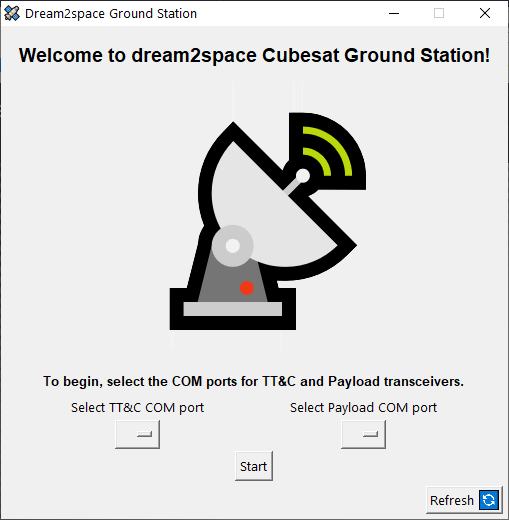
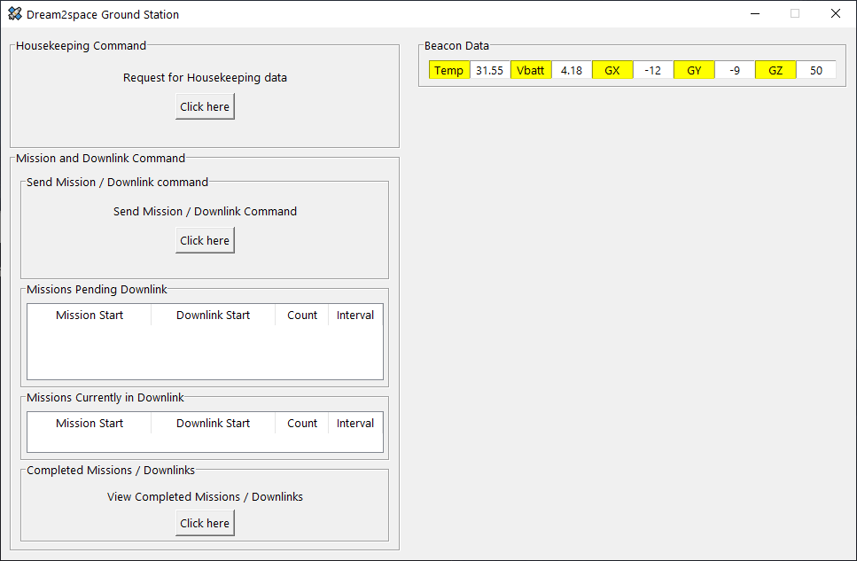
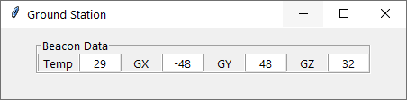

# GUI Ground Station

The [command line ground station](https://github.com/huiminlim/ground_stn) was built previously, so it's time for the GUI ground station to be built.





## Getting Started

## Requirements Gathering

## UI/UX Design and Mockup

The beacons screen were added first.



This is how the initial beacon tickers work.


## Software Architecture

## Info

How to run a long running process alongside Tkinter GUI: [here](https://zetcode.com/articles/tkinterlongruntask/)

## Production

### Windows OS

To create EXE for production in Windows, type the following command into Windows Powershell:

```bash
pyinstaller Ground_Station.spec
```

The backup command is:

```bash
pyinstaller --onefile -w -i "assets/satellite.ico" Ground_Station.py
```
