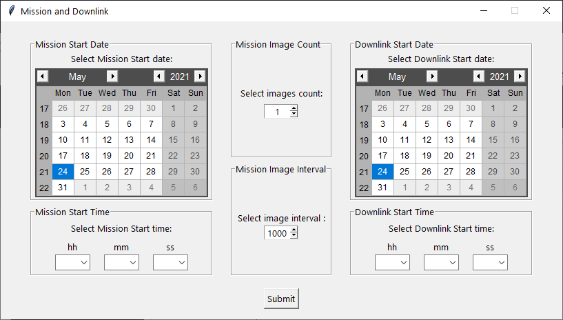

# Dreams2space GUI Ground Station

The Dream2space GUI Ground Station allows you to interact with your Dream2space Cubesat.


<br>

The Dream2space GUI Ground Station supports Beacon receiving, as well as sending Mission and Housekeeping commands.


<br>

You can issue mission commands entirely from a GUI interface with great ease.


<br>

Contents
========

 * [Why?](#why)
 * [Installation and Usage](#installation-and-usage)
 * [Design Journey](#design-journey)
 * [Developers' Guide](#developers-guide)

## Why?

The [command line ground station](https://github.com/huiminlim/ground_stn) was built previously, so it's time for the GUI ground station to be built.

## Installation and Usage

Click [here](v0.2-doc/Ground_Stn_Doc.md) to view the Installation and Usage guide.

## Design Journey

Click [here](docs/design-journey.md) to view the Design journey.

## Developers' Guide

### Software Architecture

#### Info

How to run a long running process alongside Tkinter GUI: [here](https://zetcode.com/articles/tkinterlongruntask/)

### Production in Windows OS

To create EXE for production in Windows, type the following command into Windows Powershell:

```bash
pyinstaller Ground_Station.spec
```

The backup command is:

```bash
pyinstaller --onefile -w -i "assets/satellite.ico" Ground_Station.py
```

### Downlink Notes

This note is for downlink mission implementation.
