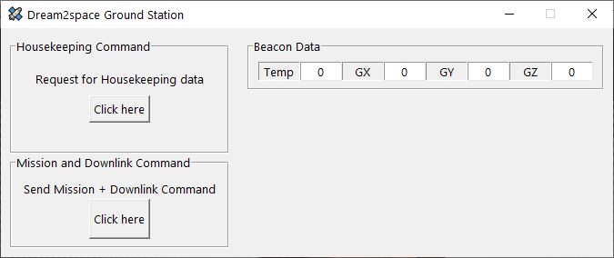

# Design Journey

## Requirements Gathering

## UI/UX Design and Mockup

The beacons screen were added first.

This is how the initial beacon tickers work.

Then the housekeeping data panels were added.

