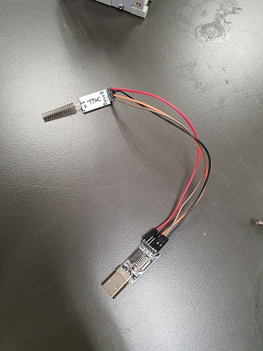
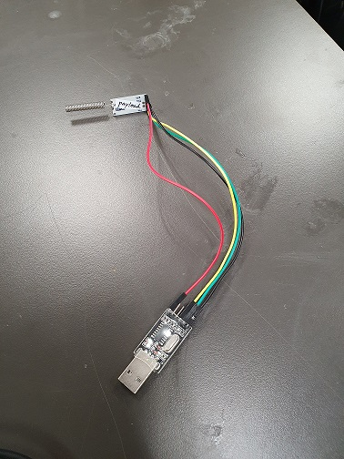
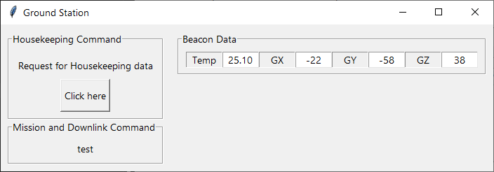
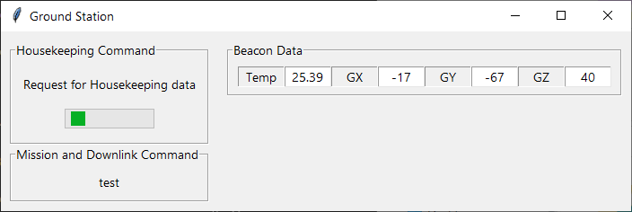
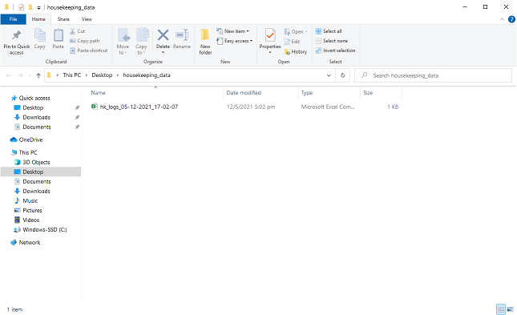
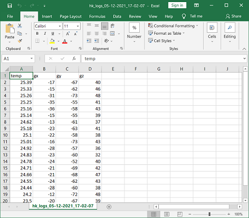

# dream2space Cubesat Ground Station

This document covers the usage of the Ground Station app to interact with the dream2space Cubesat.

## Getting Started

To begin, download the Ground Station Desktop app.

Download the latest version of the Ground Station Desktop app `Ground_Stn.exe` from the `Releases` page [here](https://github.com/dream2space/dream2space-ground_station/releases).

Navigate to the section as shown in the screenshot below to find the latest version of the Ground Station Desktop app.

You can find the latest version of the Ground Station Desktop app and the Version tag in the table below.

| Executable Name  | Version Number |
| ---------------- | -------------- |
| `Ground_Stn.exe` | `v-hk-logs`    |

Click on the `Ground_Stn.exe` under the `Assets` section to download it.

After downloading the Desktop app, start the Ground Station Desktop app.

A security warning may pop up in some cases. In such cases, click on `More Info` as shown in the screenshot below.

After that, click on `Run anyway`.

To check if the Ground Station is downloaded correctly, the Ground Station Desktop app will appear, like in the screenshot below.

## Features

The Ground Station app has several functions to interact with the CubeSat.

### Port Setup

| ⚠️ | **Ensure that your Ground Station app is closed before continuing with this section.** |
| - | -------------------------------------------------------------------------------------- |

To setup the Ground Station, connect the 2 transceivers to talk to the TT&C and Payload to your laptop.

The transceivers need a intermediary bridge to connect its pins to the USB ports of laptops and an USB adapter is used.

This is how the TT&C transceiver connected to the USB adapter.

Similarly, this is how the Payload transceiver is connected to the USB adapter.

The first page of the Ground Station app shows the serial port selection.

Click [here](#for-windows) for Window OS instructions and [here](#for-mac) for Mac.

| 💡 | **Plug the transceivers into your laptop sequentially for this step.** |
| --- | -------------------------------------------------------------------- |

#### For Windows

Plug in the USB adapter for the TT&C transceiver to the laptop.

Take note of the COM port assigned to the TT&C transceiver's USB adapter by checking the Device Manager.

Plug in the USB adapter for the Payload transceiver to the laptop.

Take note of the COM port assigned to the Payload transceiver's USB adapter by checking the Device Manager.

Select the correct Ports in the Ground Station with the COM ports noted down by clicking on the respective drop down menus.

To complete, click on `Start`.

#### For Mac

In progress.

### Beacons

The panel on the right is to display the Beacons that the Cubesat sends out every 60 seconds.

Once the Ground Station receives a new Beacon, the fields will display a yellow alert when it updates the Beacon panel.

### Housekeeping Data Telecommands

The top left panel is dedicated to the Housekeeping Command.

The housekeeping data command is sent from the Ground Station to the Cubesat's TT&C transceiver to retrieve a log of satellite sensor data.

To retrieve the log of satellite sensor data from the Cubesat, click on the `Click here` button.

The telecommand will be sent from the Ground Station to the Cubesat.

Wait for the housekeeping data is transmitted from the Cubesat back to the Ground Station.

Upon completion of the housekeeping data transmission, the folder containing the housekeeping data will appear and the log will be saved in CSV file format.

The folder will be created in the same location as the Ground Station app.

Click on the CSV file to view the log.

### Mission and Downlink Telecommands

In progress.
