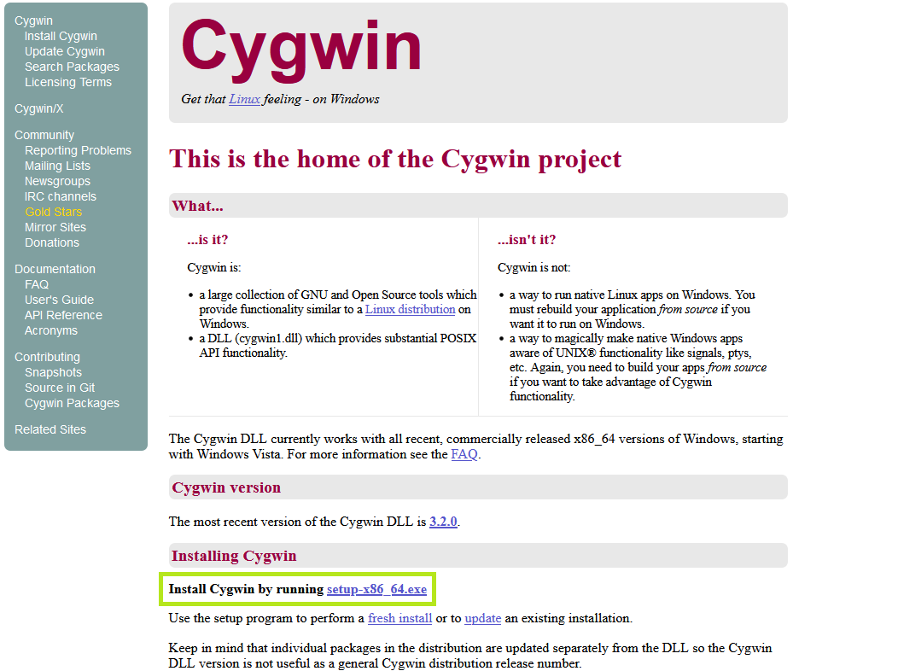
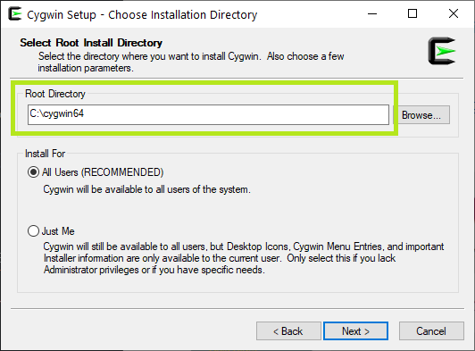
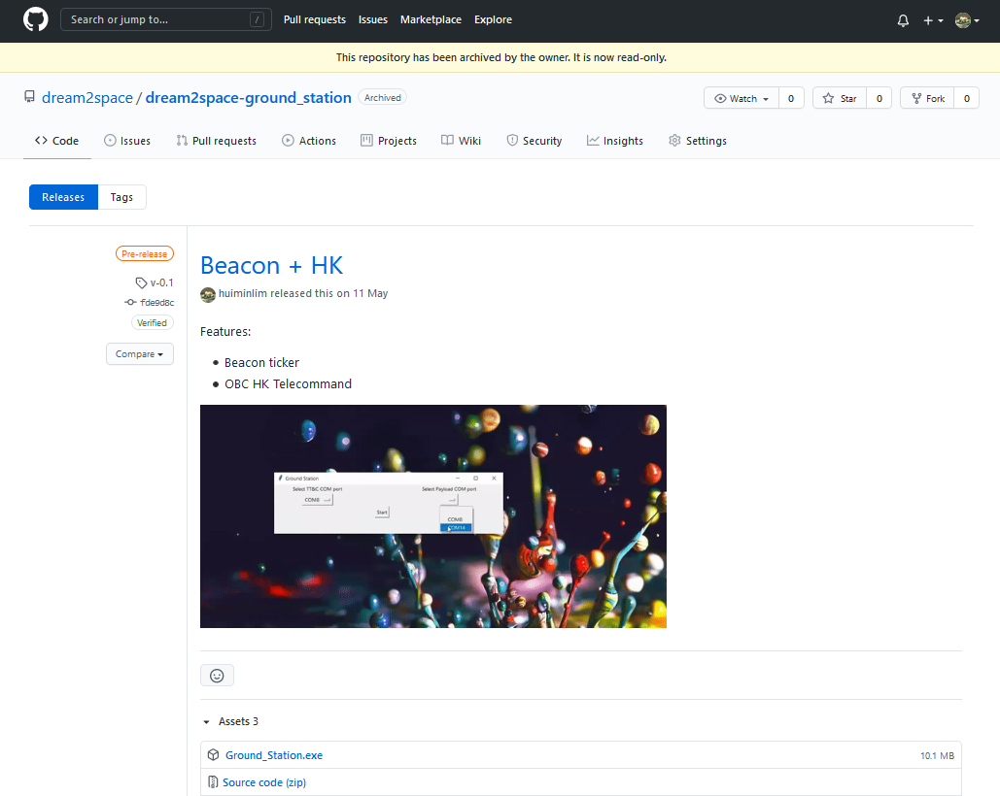

# Dream2space Cubesat Ground Station
<!-- markdownlint-disable MD033 -->
<!--TODO: Break down into smaller steps per header-->

This document covers the usage of the Ground Station app to interact with the dream2space Cubesat.

<!-- markdownlint-disable MD025 MD003 -->
Contents
========
<!-- markdownlint-enable MD025 MD003 -->

- [Prerequisites (For Windows)](#prerequisites-for-windows)
  - [Step 1: Visit the Cygwin website](#step-1-visit-the-cygwin-website)
  - [Step 2: Download Cygwin installer](#step-2-download-cygwin-installer)
  - [Step 3: Install Cyg](#step-3-install-cyg)
- [Getting Started](#getting-started)

## Prerequisites (For Windows)

This step is needed if you are using a computer that runs on a **Windows** operating system.

The Ground Station app requires an additional software **Cygwin** to run.

### Step 1: Visit the Cygwin website

To download Cygwin, click the link [here](https://www.cygwin.com/).

Link to download Cygwin: <https://www.cygwin.com/>

The Cygwin page should look like this:

### Step 2: Download Cygwin installer

Click on the link `setup-x86_64.exe` to download the Cygwin installer, as shown in the **green** box in the screenshot above.

### Step 3: Install Cyg

Proceed to install Cygwin using the installer.

When prompted to choose Installation Directory, ensure that the Root Directory is `C:\cygwin64`.

The step and the correct Root Directory is shown in the **green** box in the screenshot below.

## Getting Started

To begin, download the Ground Station app.

Download the latest version of the Ground Station app `Ground_Stn.exe` from the `Releases` page [here](https://github.com/dream2space/dream2space-ground_station/releases). <!--TODO: Update to a direct link to the exact releases-->

Link to download Ground Station app: <https://github.com/dream2space/dream2space-ground_station/releases/> <!--TODO: Update to a direct link to the exact releases-->

The `Releases` page should look like this:

  <!--TODO: Fix to correct image and rename to replace-->

You can find the latest version of the Ground Station app and the Version tag in the table below.

| Executable Name      | Version Number |
| -------------------- | -------------- |
| `Ground_Station.exe` | `v-hk-logs`    |
<!--TODO: Correct the version number to match the screenshot/latest version-->

Click on the `Ground_Stn.exe` under the `Assets` section to download it.
