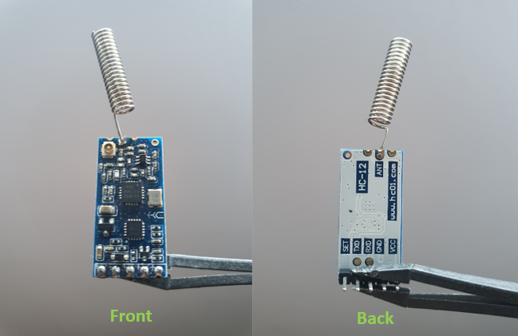

# Dream2space Cubesat Ground Station
<!-- markdownlint-disable MD033 -->

[comment]: <> (TODO: Break down into smaller steps per header)

The Dream2space GUI Ground Station allows you to interact with your Dream2space Cubesat.

<!-- markdownlint-disable MD025 MD003 -->
Contents
========
<!-- markdownlint-enable MD025 MD003 -->

- [Prerequisites (For Windows)](#prerequisites-for-windows)
  - [Step 1: Visit the Cygwin website](#step-1-visit-the-cygwin-website)
  - [Step 2: Download Cygwin installer](#step-2-download-cygwin-installer)
  - [Step 3: Install Cygwin](#step-3-install-cygwin)
- [Getting Started](#getting-started)
  - [Step 1: Download the Ground Station app](#step-1-download-the-ground-station-app)
  - [Step 2: Setup the Ground Station transceivers](#step-2-setup-the-ground-station-transceivers)
  - [Step 3: Connect the TTnC transceiver to the Computer](#step-3-connect-the-ttnc-transceiver-to-the-computer)
  - [Step 4: Connect the Payload transceiver to the Computer](#step-4-connect-the-payload-transceiver-to-the-computer)
  - [Step 5: Open up the Ground Station app](#step-5-open-up-the-ground-station-app)

## Prerequisites (For Windows)

This step is needed if you are using a computer that runs on a **Windows** operating system.

The Ground Station app requires an additional software **Cygwin** to run.

### Step 1: Visit the Cygwin website

To download Cygwin, click the link [here](https://www.cygwin.com/).

Link to download Cygwin: <https://www.cygwin.com/>

The Cygwin page should look like this:

### Step 2: Download Cygwin installer

Click on the link `setup-x86_64.exe` to download the Cygwin installer, as shown in the **green** box in the screenshot above.

### Step 3: Install Cygwin

Proceed to install Cygwin using the installer.

When prompted to choose Installation Directory, ensure that the Root Directory is `C:\cygwin64`.

The step and the correct Root Directory is shown in the **green** box in the screenshot below.

## Getting Started

### Step 1: Download the Ground Station app

To begin, download the Ground Station app.

Download the latest version of the Ground Station app `Ground_Stn.exe` from the `Releases` page [here](https://github.com/dream2space/dream2space-ground_station/releases).

[comment]: <> (TODO: Update to a direct link to the exact releases)

Link to download Ground Station app: <https://github.com/dream2space/dream2space-ground_station/releases/>

[comment]: <> (TODO: Update to a direct link to the exact releases)

The `Releases` page should look like this:

You can find the latest version of the Ground Station app and the Version tag in the table below.

| Executable Name      | Version Number |
| -------------------- | -------------- |
| `Ground_Station.exe` | `v-hk-logs`    |

[comment]: <> (TODO: Correct the version number to match the screenshot/latest version)

Click on the `Ground_Station.exe` under the `Assets` section to download it.

### Step 2: Setup the Ground Station transceivers

The Ground Station has two 433 MHz transceivers to communicate with the TT&C and the Payload of the Dream2space cubesat respectively.

This is how a transceiver looks like:

The transceiver uses the Universal asynchronous receiver-transmitter (UART) protocol to send data to and from the computer and a USB-UART bridge to connect the transceiver to the computer's USB ports.

This is how a USB-UART bridge looks like:

Ensure that the pin connections are done as shown in the table below:

| USB-UART bridge | Transceiver |
| --------------- | ----------- |
| `5V`            | `Vcc`       |
| `GND`           | `GND`       |
| `TX`            | `RX`        |
| `RX`            | `TX`        |

An example of the transceiver connected to the USB-UART bridge is shown below:

### Step 3: Connect the TTnC transceiver to the Computer

| ⚠️ | **The sequence of plugging in the USB-UART bridges is important. Do try to follow the sequence.** |
| - | ------------------------------------------------------------------------------------------------ |

The computer identifies the USB-UART bridges as virtual `COM` ports and each bridge is assigned a unique `COM` port number upon plugging in the USB.

The Ground Station app needs to know `COM` port number for the TT&C and Payload transceiver to read and write to the respective transceivers.

The TT&C transceiver comes with a label on the transceiver, as shown in the image below.

Plug in the TT&C transceiver's USB-UART bridge into the computer. The computer should detect the USB `COM` port and the `COM` port can be found using the Device Manager.

Note down the `COM` port for the TT&C transceiver's USB-UART bridge.

### Step 4: Connect the Payload transceiver to the Computer

| ⚠️ | **The sequence of plugging in the USB-UART bridges is important. Do try to follow the sequence.** |
| - | ------------------------------------------------------------------------------------------------ |

The payload transceiver comes with a label on the transceiver, as shown in the image below.

Plug in the Payload transceiver's USB-UART bridge into the computer. The computer should detect the USB `COM` port and the `COM` port can be found using the Device Manager.

Note down the `COM` port for the Payload transceiver's USB-UART bridge.

### Step 5: Open up the Ground Station app

| ⚠️ | **This is the recommended way to open up the GUI exe. Other methods may cause errors.** |
| - | --------------------------------------------------------------------------------------- |

Navigate to the folder containing the downloaded GUI exe, as shown in the folder below.

Double click on the icon to launch the app.

If the app has launched successfully, the Start Page (as shown in screenshot below) will appear.

